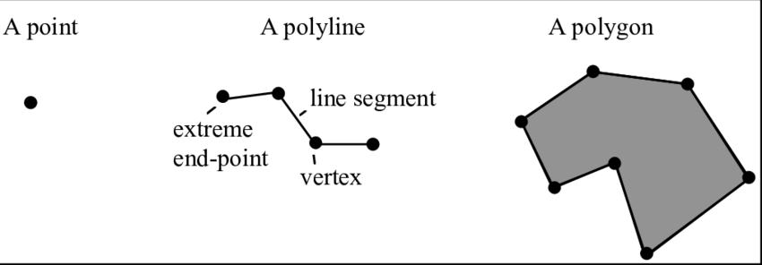

footer: © APSU GIS Center 2020
slidenumbers: true

# GIS Training

---

## Introduction

---

## Who am I?

- GIS Director at Austin Peay State University
- Over 20 years experience in GIS and Technology
- Worked Extensively with First Responders

---

## Training Goals

- Learn about GIS Basics
- Better Utilize Google Earth
- Learn about the basics of using QGIS
- Use Data on Mobile

---

## What is GIS?

---

## What is GIS? - A Definition

**A system designed to create, store, manipulate, analyze, manage, and present all types of geographical data.**

GIS Components:

- Hardware
- software
- Data
- Workflows
- People

---

## What is GIS? - Examples of GIS

Some Examples Include:

- Google Maps
- 911 Systems
- Online Maps
- Google Earth
- Custom GIS Software

---

## What is GIS? - GIS Software

Commercial vs Open Source

---

## GIS Data

---

## GIS Data - Data Types

### What are GIS Data Types

- Points
- Lines
- Polygon
- Rasters

---

## GIS Data - Databases

---

## GIS Data - Data Availability

---

## GIS Data - Data Formats

---

## Intro to Google Earth

---

## Intro to QGIS

---

## GIS and Mobile Devices

---

## Questions

