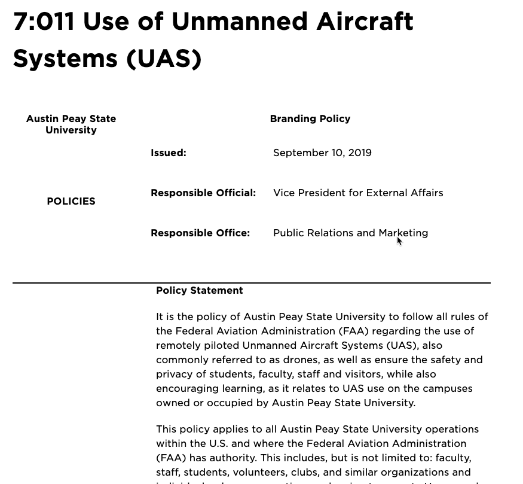

footer: © APSU GIS Center 2019
slidenumbers: true

## A Practical Application of Drone Technology - A Quick How to

### Mike Wilson, APSU GIS Director

#### wilsonm@apsu.edu
#### (931) 221-7500

---

## Overview

- Who is flying?
- Find the Tool to Fit the job
- Who's Paying for What?
- What are your campus policies?
- Where do drones fit on your campus?

---

# Who is Flying?

- Part 107 Pilots are needed
  - Any pilot most either be a Part 107 Pilot or Supervised by one.
- Part 107 Certification requires testing ($150 for the test)
  - Study on your own
  - Paid Online Courses ($ Varies)
  - Remote Pilot on iOS ($5)

---

# Find the Tool to Fit the Job

- Fixed wing aircraft 
  - Longer Flight times/range
  - More expensive
- Quad Copters
  - Limited flight time/range
  - COTS
- Sensors
  - Visual
  - Thermal
  - Other

---

# Who's Paying for What?

- Pilot Training
- Insurance
- Drones
- Software

---

# A Note on Software

- Software is required to Process Drone Imagery
- Options
  - ESRI - Not included in GIS Site Licenses
  - Pix4D - Monthly Subscription Available
  - Others

---

# What are your Campus Policies?

- Your campus with either have a policy or will have one soon.

---

# Where do drones fit on your campus?

- At APSU - UAV are a tool not a science
- We Work with the Campus Community
- Work with Local Agencies
  - Manhunts
  - Missing Child
  - Disaster Response
  - Industrial Development
  - InnovaTN (innovatn.org)

---

# Questions?

#### wilsonm@apsu.edu
#### (931) 221-7500

